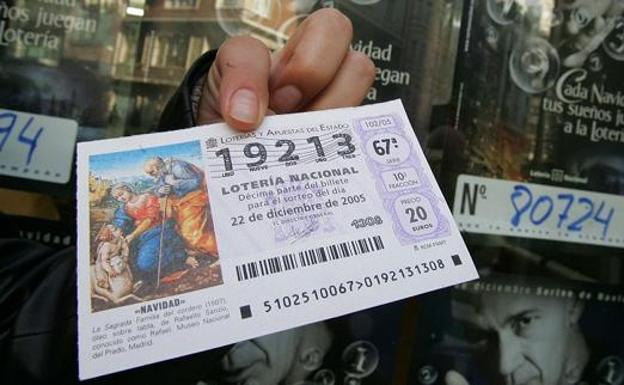
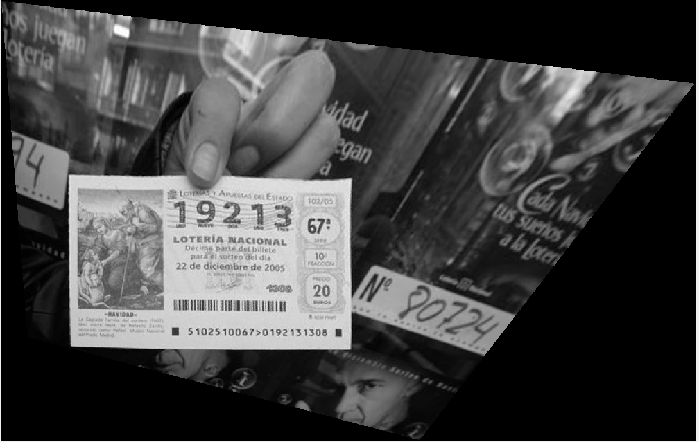
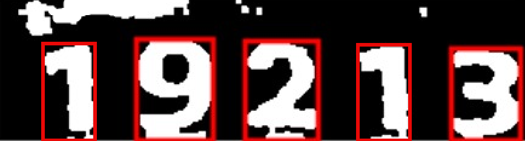

# lottery ticket recognition

This project allows the user to run a MATLAB program that, given an input image with a lottery ticket, fill locate and identify all the digits.

As an example, this is a possible input image:

The program now does a cornet detection using Harris method. Basically, it is compared to a base image that has the proper orientation and rotation. By matching points from both images, a Direct Linear Transofmation is done and, as a result, the new image is properly aligned.

A crop is made now that the overall location of the numbers is known. It is followed by a binarization and some morphological operations. Looking for contiguous regions and filtering according to area and relative postion, the location for each individual digit is found.

The identification for each digit is done by comparing it to all 10 possible values, by means of Mean Squred Error. 

